# Node Red - WDX - Examples

WDX NodeRED Pallette Examples for various WDX IoT features.

## Table of Contents

- [Requirements](#requirements)
- [Installation](#installation)
- [Examples](#examples)
  - [WDX Instance - Nodes Examples](#wdx-instance-nodes-examples)
  - [WDX Data - Nodes Examples](#wdx-data-nodes-examples)

## Requirements

+ Node-RED editor.
+ Node-RED WDX Pallete.

## Installation

To install the WDX NodeRED pallette, follow these steps:

1. Open your Node-RED editor.
2. Install [Node-RED WDX nodes palette](https://github.com/elrest-cz/wdx-node-red/).
3. Import flows from the provided JSON files [flow.json](https://github.com/elrest-cz/wdx-node-red-examples/blob/master/flow.json).

## Examples

### WDX Instance - Nodes Examples

WDX IoT instance pallete nodes will connect data from any WDX supported device into data layer. You can  manage these connection within Node-RED WDX Instance pallete nodes.

#### Save Example

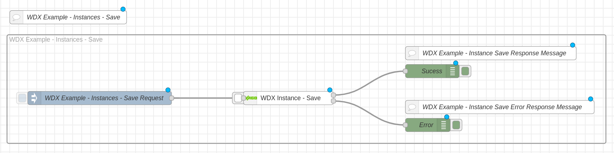

#### Monitor Example

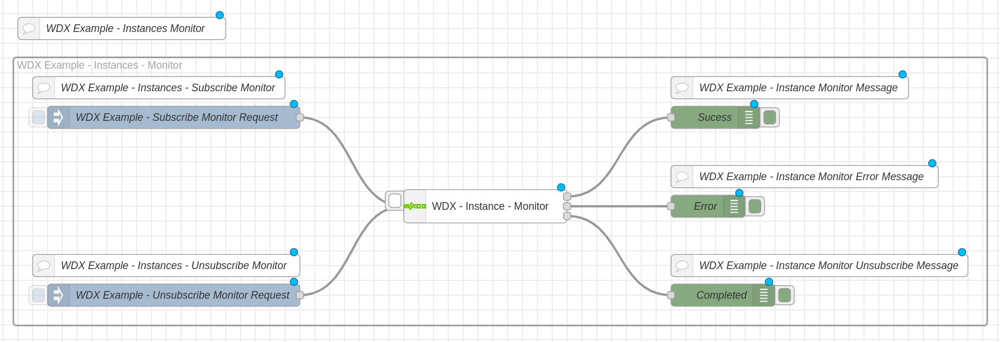

#### Monitor Log Example

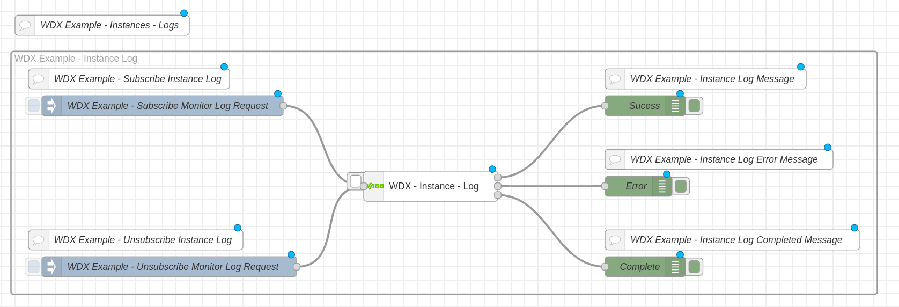

#### Start Example

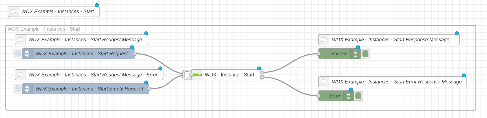

#### Detail Example

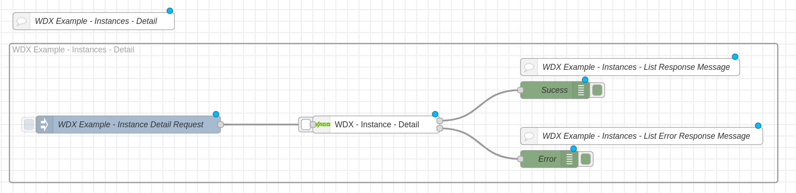

#### List Example

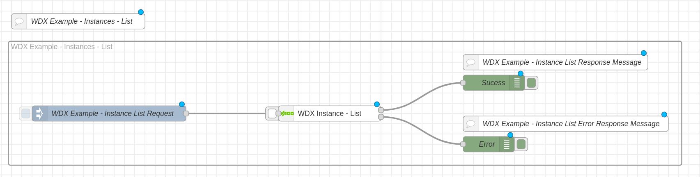

#### Stop Example

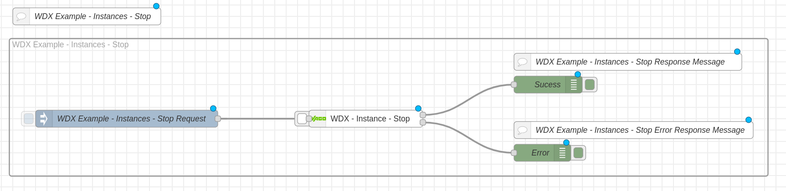

#### Restart Example

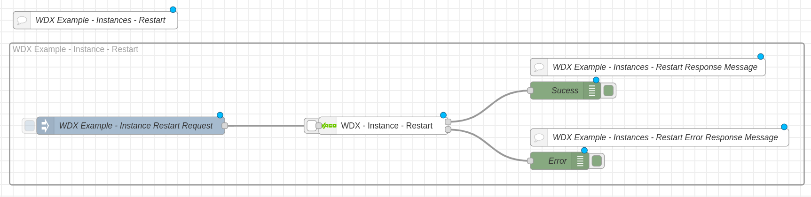

#### Delete Example

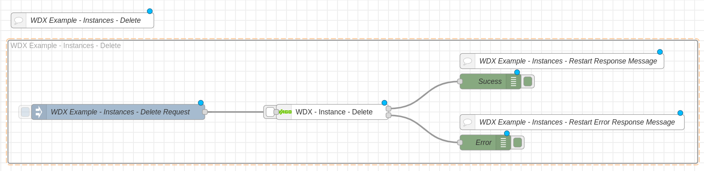

### WDX Data - Nodes Examples

WDX IoT data pallette nodes allows you to manage these IoT data schemas provided within one Data interface on different IoT devices.

#### Schema Monitor Example

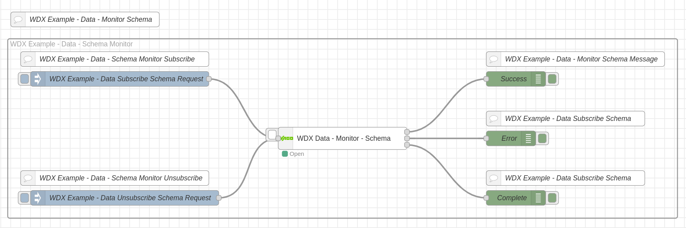

#### Schema Save Example

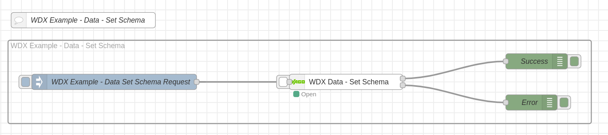

#### Schema Get Example

#### Value Monitor Example

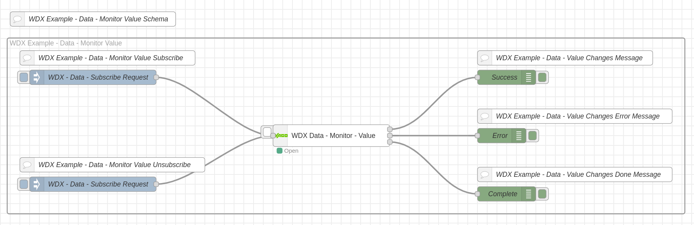

#### Value Set Example

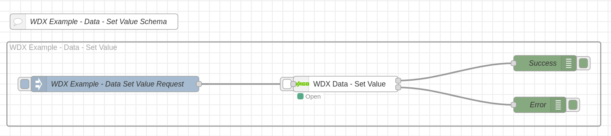

#### Value Get Example

